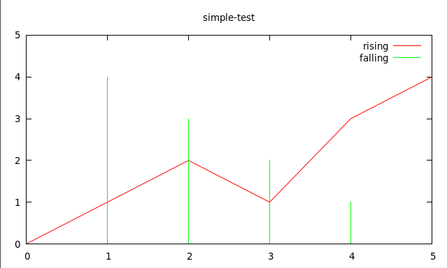

# Gnuplot

A really simple Clojure interface to Gnuplot. Useful when you just wanna plot
some points. A lot of points. More points than Incanter or Analemma can
reasonably handle.

## Installation

You'll need `gnuplot` installed and on your path--see your OS's package manager. After that, just add [the latest version from Clojars](https://clojars.org/gnuplot) to your `project.clj`.

## Usage

I dunno bout the API here, so I'm calling it `raw-plot!` Maybe I'll wrap it in
a nicer `plot` api later. Just need something simple n flexible for now.

```clj
(require '[gnuplot.core :as g])
(g/raw-plot! ; Commands
             [[:set :title "simple-test"]
              [:plot (g/range 0 5)
               (g/list ["-" :title "rising" :with :lines]
                       ["-" :title "falling" :with :impulse])]]
             ; Datasets
             [[[0 0]
               [1 1]
               [2 2]
               [3 1]
               [4 3]
               [5 4]]
              [[0 5]
               [1 4]
               [2 3]
               [3 2]
               [4 1]
               [5 0]]]))
```



## Performance

Datasets are streamed as sequences directly to gnuplot's stdin, so there's no
temporary files to worry about. Yep, lazy sequences are streamed lazily. My
laptop can plot about 10 million points in about a minute, and most of the CPU
time is spent inside gnuplot in that test, so I'm reasonably happy.

## License

Copyright © 2015 Kyle Kingsbury

Distributed under the Eclipse Public License either version 1.0 or (at
your option) any later version.
